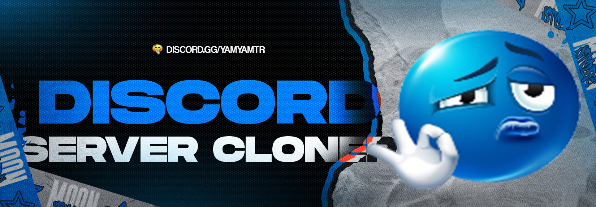
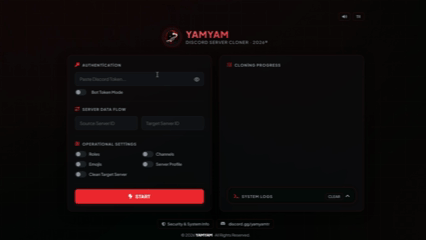

# 🌀 DISCORD SERVER CLONER

  
   
  <b>Advanced & High-Speed Discord Server Cloning Web Tool</b>

---

## ・What is it?

**DISCORD SERVER CLONER** is a premium, client-side web application designed to clone Discord servers in real time. Featuring a sleek glassmorphism UI, a real-time console log, and an adaptive request queue, it replicates categories, channels, roles, permissions, and settings from a source server directly to a target server.

  

---

## ・Key Features

### 1. Modern Glassmorphism UI
* **Futuristic Visual Design:** Glowing dark-mode theme with vibrant neon highlights, layered transparency, and smooth responsive styling.
* **Real-Time Console Log:** Interactive visual scrolling console displaying exact actions, successful migrations, and API rate-limit delays.
* **Instant Dashboard Statistics:** Real-time counters showing progress metrics for roles, channels, categories, and custom emojis.

### 2. Full Server Replication
* **Category & Channel Structure:** Clones all categories, text channels, voice channels, and announcement channels, preserving their exact hierarchy and positions.
* **Roles & Permissions Hierarchy:** Recreates all roles, custom hex colors, hoisting preferences, and precise permission overrides on a channel-by-channel basis.
* **Server Customization Backup:** Copies general server configuration, system channel mappings, verification rules, and media filters.

### 3. Rate Limit Evasion & Queue Management
* **Smart Throttling Engine:** Controls the speed of API calls to seamlessly respect Discord's rate-limit guidelines.
* **Auto-Resume Logic:** Smoothly handles `429 Too Many Requests` limits by pausing, waiting for the cooldown, and resuming automatically.

### 4. Client-Side Independence
* **Zero Installation:** Runs directly in any web browser without requiring Python, Node.js, command-line dependencies, or local packages.
* **Token Safety:** Processes all API requests locally in your browser. Tokens are never sent to external servers or logged.

---

## ・Usage & Requirements

### Technical Requirements
* **Platform:** Any modern web browser (Chrome, Edge, Firefox, Brave, Safari, Opera).
* **No Dependencies:** Pure HTML/JS standalone application.

### Execution

#### Step 1: Open the Application
Double-click `panel.html` to open it in your default web browser, or host it locally.

#### Step 2: Input Credentials & Target Identifiers
1. Enter your Discord Account Token (User/Bot token) in the designated field.
2. Input the **Source Server ID** (the server structure you want to copy).
3. Input the **Target Server ID** (the server you own where you want to paste the structure).

#### Step 3: Run the Cloner
Click the **Clone** button and monitor the real-time visual logger for progress updates and completion status.

---

## ・Disclaimer

This tool is provided for **educational, testing, and backup purposes only**. Cloning servers without authorization and using user tokens (selfbotting) is against Discord's Terms of Service and can result in account termination. The developer assumes no liability for system changes, account suspensions, or misuse of this tool.

---

developed by <b>latei</b>

